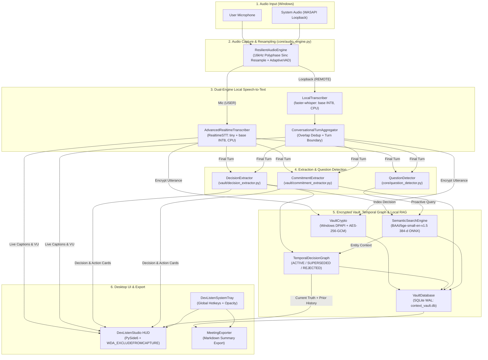

# DevListen System Architecture

This diagram reflects the implemented Windows desktop pipeline in `main.py` and its supporting modules (`core/`, `vault/`, `export/`, `ui/`).

```mermaid
flowchart TD
    subgraph Input["1. Audio Input (Windows)"]
        MIC["User Microphone"]
        SYS["System Audio (WASAPI Loopback)"]
    end

    subgraph Audio["2. Audio Capture & Resampling (core/audio_engine.py)"]
        ENG["ResilientAudioEngine\n(16kHz Polyphase Sinc Resample + AdaptiveVAD)"]
        MIC --> ENG
        SYS --> ENG
    end

    subgraph ASR["3. Dual-Engine Local Speech-to-Text"]
        RT["AdvancedRealtimeTranscriber\n(RealtimeSTT: tiny + base INT8, CPU)"]
        LT["LocalTranscriber\n(faster-whisper: base INT8, CPU)"]
        TA["ConversationalTurnAggregator\n(Overlap Dedup + Turn Boundary)"]
        ENG -->|"Mic (USER)"| RT
        ENG -->|"Loopback (REMOTE)"| LT
        LT --> TA
    end

    subgraph Extract["4. Extraction & Question Detection"]
        QD["QuestionDetector\n(core/question_detector.py)"]
        DE["DecisionExtractor\n(vault/decision_extractor.py)"]
        CE["CommitmentExtractor\n(vault/commitment_extractor.py)"]
        RT -->|"Final Turn"| QD & DE & CE
        TA -->|"Final Turn"| QD & DE & CE
    end

    subgraph Storage["5. Encrypted Vault, Temporal Graph & Local RAG"]
        CR["VaultCrypto\n(Windows DPAPI + AES-256-GCM)"]
        DB["VaultDatabase\n(SQLite WAL: context_vault.db)"]
        TG["TemporalDecisionGraph\n(ACTIVE / SUPERSEDED / REJECTED)"]
        RAG["SemanticSearchEngine\n(BAAI/bge-small-en-v1.5 384-d ONNX)"]

        RT & TA -->|"Encrypt Utterance"| CR --> DB
        DE --> TG --> DB
        CE --> DB
        DE -->|"Index Decision"| RAG --> DB
        QD -->|"Proactive Query"| RAG
        RAG -->|"Entity Context"| TG
    end

    subgraph UI["6. Desktop UI & Export"]
        HUD["DevListenStudio HUD\n(PySide6 + WDA_EXCLUDEFROMCAPTURE)"]
        TRAY["DevListenSystemTray\n(Global Hotkeys + Opacity)"]
        EXP["MeetingExporter\n(Markdown Summary Export)"]

        RT & TA -->|"Live Captions & VU"| HUD
        DE & CE -->|"Decision & Action Cards"| HUD
        TG -->|"Current Truth + Prior History"| HUD
        DB --> EXP
        TRAY --> HUD & EXP
    end
```
